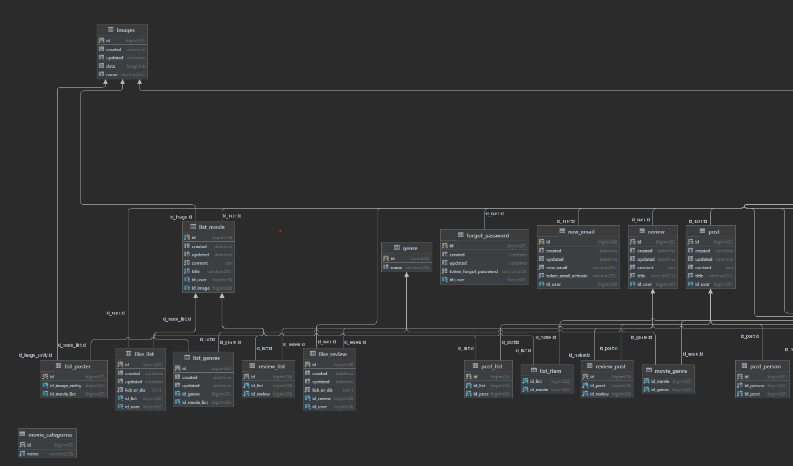
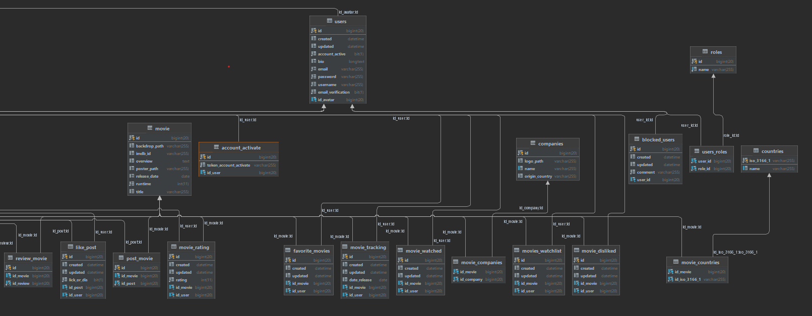

# MoviePocket Developer documentation

## Introduction

MoviePocket is movie management system that will help you to orginize your movie collection and share it with other
movie lovers. The more percise description of the service you can find in Documentation/ section:)

Explore world of movies with MoviePocket and create your personal unforgettable experience collecting sharing movies
between users.

## To start develop

1. [Introduction](#introduction)
2. [Backend (Java Spring)](#backend-java-spring)
    - [You will need](#you-will-need-)
    - [API Documentation](#api-documentation)
    - [Database Schema](#database-schema)
    - [Authentication](#authentication)
    - [Error Handling](#error-handling)
3. [Frontend (React.js)](#frontend-reactjs)
    - [Project Structure](#project-structure)
    - [Component Documentation](#component-documentation)
    - [API Integration](#api-integration)
4. [Mobile App Android](#mobile-app-android)
    - [General](#general)
    - [Authentication](#authentication)
    - [Deployment](#deployment)
        - [Backend And Frontend Deployment](#backend-and-frontend-deployment)
        - [Mobile App Deployment](#mobile-app-deployment)
5. [Contributing](#contributing)
    - [Version Control](#version-control)
    - [Testing](#testing)
    - [Changelog](#changelog)
6. [License](#license)

## Introduction

MoviePocket is movie management system that will help you to orginize your movie collection and share it with other
movie lovers. The more percise description of the service you can find in Documentation/ section:)

Explore world of movies with MoviePocket and create your personal unforgettable experience collecting sharing movies
between users.

## Backend Java [Spring](https://spring.io/)
### You will need:

- [Java(at least 1.8)](https://www.oracle.com/java/technologies/downloads/), **Spring boot** version at least 2.7.10 and
  Spring 5.X bounded with Maven for backend
    - Cookie based authentication by [Spring Security](https://spring.io/projects/spring-security) 2.7
    - ORM: Hibernate v 5. + JPA
    - port used for local: _8080_

### API Documentation

Info about API endpoints, request/response examples, and any required headers generated by Swageer UI and can be found
by ```{hostname}/swagger-ui.html ```

MVP pattern is used.


### Database Schema

MySql is used. DB script can be found in [DbScript](Documentation/DB_and_UI_prototypes/DbScript) 

DB schema





### Authentication

Cookie based authentication is implemented. Cookie expiration set to -1 and can be changed in [application.properties](src/main/resources/application.properties) file

### Error Handling

Most errors are handled by ResponseEntity and Http status codes responses
Main codes used are:
1. ```200 Ok```
2. ```401 Unauthorized```
3. ```403 Forbidden```
4. ```404 Not found```
5. ```500 Server error```

## Frontend [React.js](https://react.dev/reference/react)

### Project Structure

Describe the project directory structure and organization.

### Component Documentation

Document each React component, including its purpose, props, and usage.

- Component Buttons
  - [DislikedMovieButton](..%2FMoviePocket-Frontend%2Fsrc%2Fcomponents%2Fbuttons%2FDislikedMovieButton.js)
      - Purpose: The DislikedMovieButton component is a reusable React component designed to represent a button that allows users to dislike a movie. It interacts with the server to check the current disliked state of the movie and enables users to toggle the dislike state by clicking the button.
      - Props: 
        - idMovie (Required, Number): The unique identifier of the movie for which the dislike button is being displayed.
        - className (Optional, String): Additional CSS class name(s) that can be provided to customize the styling of the button.
      - Usage: the DislikedMovieButton is used within a MovieDetails component, where idMovie is set to the unique identifier of the movie being displayed. The optional className prop is used to customize the styling of the button.

This component utilizes the AuthContext to check if the user is logged in before allowing them to dislike a movie. When the button is clicked, it toggles the dislike state and sends a request to the server to update the dislike status.
  - [FavoriteMovieButton](..%2FMoviePocket-Frontend%2Fsrc%2Fcomponents%2Fbuttons%2FFavoriteMovieButton.js)
      - Purpose: The FavoriteMovieButton component is a reusable React component designed to represent a button that allows users to mark a movie as a favorite. It interacts with the server to check the current favorite state of the movie and enables users to toggle the favorite state by clicking the button.
      - Props:
        - idMovie (Required, String): The unique identifier of the movie for which the favorite button is being displayed.
        - className (Optional, String): Additional CSS class name(s) that can be provided to customize the styling of the button.
      - Usage:  the FavoriteMovieButton is used within a MovieDetails component, where idMovie is set to the unique identifier of the movie being displayed. The optional className prop is used to customize the styling of the button.
  - [RatingComponent](..%2FMoviePocket-Frontend%2Fsrc%2Fcomponents%2Fbuttons%2FRatingComponent.js)
    - Purpose:  The RatingComponent is designed to provide a user interface for selecting a rating using star icons. It uses state to track the selected rating and updates the display dynamically.
    - Props: rating: A state variable that holds the selected rating. It is initially set to null and gets updated when a star is clicked.
  - [ToWatchMovieButton](..%2FMoviePocket-Frontend%2Fsrc%2Fcomponents%2Fbuttons%2FToWatchMovieButton.js)
    - Purpose: The ToWatchMovieButton component serves as a button that allows users to add or remove movies from their "To Watch" list. It displays a tooltip and changes its appearance based on whether the movie is in the "To Watch" list or not.
    - Props:
      - toWatch: A state variable that holds whether the movie is in the "To Watch" list. It is initially set to false and gets updated when the user clicks the button.
      - isLoggedIn: The component uses the AuthContext to check if the user is logged in.
  - [WatchMovieButton.js](..%2FMoviePocket-Frontend%2Fsrc%2Fcomponents%2Fbuttons%2FWatchMovieButton.js)
    - Purpose: The WatchMovieButton component serves as a button that allows users to mark a movie as watched. It displays a tooltip and changes its appearance based on whether the movie has been watched or not.
    - Props:
      - watched: A state variable that holds whether the movie has been watched. It is initially set to false and gets updated when the user clicks the button.
      - isHovered: A state variable that holds whether the button is being hovered. It is used to determine the button's appearance during hover.
      - isClicked: A state variable that holds whether the button has been clicked. It is used to determine the button's appearance after being clicked.
- Component [Lists](..%2FMoviePocket-Frontend%2Fsrc%2Fcomponents%2Flists)
  - [ListOfFilms](..%2FMoviePocket-Frontend%2Fsrc%2Fcomponents%2Flists%2FListOfFilms.js)
  - [SingleList](..%2FMoviePocket-Frontend%2Fsrc%2Fcomponents%2Flists%2FSingleList.js)
  - [UserLikedList](..%2FMoviePocket-Frontend%2Fsrc%2Fcomponents%2Flists%2FUserLikedList.js)
- Component [navbar](..%2FMoviePocket-Frontend%2Fsrc%2Fcomponents%2Fnavbar)
  - [logoBar](..%2FMoviePocket-Frontend%2Fsrc%2Fcomponents%2Fnavbar%2FlogoBar)
  - [logOutComponent](..%2FMoviePocket-Frontend%2Fsrc%2Fcomponents%2Fnavbar%2FlogOutComponent)
  - [navBar](..%2FMoviePocket-Frontend%2Fsrc%2Fcomponents%2Fnavbar%2FnavBar)
  - [navBrand](..%2FMoviePocket-Frontend%2Fsrc%2Fcomponents%2Fnavbar%2FnavBrand)
  - [navList](..%2FMoviePocket-Frontend%2Fsrc%2Fcomponents%2Fnavbar%2FnavList)
  - [searchComponent](..%2FMoviePocket-Frontend%2Fsrc%2Fcomponents%2Fnavbar%2FsearchComponent)
  - [userBarComponent](..%2FMoviePocket-Frontend%2Fsrc%2Fcomponents%2Fnavbar%2FuserBarComponent)
- Component [pagination](..%2FMoviePocket-Frontend%2Fsrc%2Fcomponents%2Fpagination)
  - [Pagination](..%2FMoviePocket-Frontend%2Fsrc%2Fcomponents%2Fpagination%2FPagination.js)
- Component [poster](..%2FMoviePocket-Frontend%2Fsrc%2Fcomponents%2Fposter)
  - [MoviePoster](..%2FMoviePocket-Frontend%2Fsrc%2Fcomponents%2Fposter%2FMoviePoster.js)
  - [Poster](..%2FMoviePocket-Frontend%2Fsrc%2Fcomponents%2Fposter%2FPoster.js)
- Component [review](..%2FMoviePocket-Frontend%2Fsrc%2Fcomponents%2Freview)
  - [CreateReviewForm.js](..%2FMoviePocket-Frontend%2Fsrc%2Fcomponents%2Freview%2FCreateReviewForm.js)
  - [LikeReviewButton.js](..%2FMoviePocket-Frontend%2Fsrc%2Fcomponents%2Freview%2FLikeReviewButton.js)
  - [ReviewDeleteButton.js](..%2FMoviePocket-Frontend%2Fsrc%2Fcomponents%2Freview%2FReviewDeleteButton.js)
  - [SingleReview.js](..%2FMoviePocket-Frontend%2Fsrc%2Fcomponents%2Freview%2FSingleReview.js)
- Component [spinners](..%2FMoviePocket-Frontend%2Fsrc%2Fcomponents%2Fspinners)
  - [Spinner](..%2FMoviePocket-Frontend%2Fsrc%2Fcomponents%2Fspinners%2FSpinner.js)
- Component [top](..%2FMoviePocket-Frontend%2Fsrc%2Fcomponents%2Ftop)
  - [Top](..%2FMoviePocket-Frontend%2Fsrc%2Fcomponents%2Ftop%2FTop.js)
- Component [Layout](..%2FMoviePocket-Frontend%2Fsrc%2Fcomponents%2FLayout.js)

### API Integration

Service is using external [TMDB APi](https://developer.themoviedb.org/reference/intro/getting-started) for several operations such as poster and movie info fetching etc.

## Mobile App [Android](https://developer.android.com/)

### General

Android 10+ should be used for running

App uses mainly MVC pattern and uses both backend api endpoints and TMDB API.

### Authentication

Authentication flow is depends on Backend part as it uses backend api see [Backend (Java Spring)](#backend-java-spring)

### Deployment

#### Backend and Frontend Deployment

Both front and back end are deployed on remote linux server provided by [UAM WMI](https://wmi.amu.edu.pl/en)

Server information and connection credentials can be found [Here](Documentation%2FDeploy%2FNowa_maszyna_wirtualna_Helpdesk_WMI_Biuro_Obs%3Fugi_Klienta.pdf)
#### Mobile App Deployment

Android app is deployed to [Google Play](https://play.google.com/store/apps?hl=en&gl=US&pli=1)

## Contributing

### Version Control

Backend: https://github.com/prymakD/MoviePocket

Frontend: https://github.com/EkintoQ/MoviePocket-Frontend

Android: https://github.com/AntonPazniak/MoviePocketAndroid/tree/master

### Testing

Document the testing strategy for backend, frontend, and mobile app components.

### Changelog

v. 1.0.0

## License

[Proprietary license](https://en.wikipedia.org/wiki/Proprietary_software)

Please add header to created files
```
/**
* Copyright (C) {MoviePocket} - All Rights Reserved
*
* This source code is protected under international copyright law.  All rights
* reserved and protected by the copyright holders.
* This file is confidential and only available to authorized individuals with the
* permission of the copyright holders.  If you encounter this file and do not have
* permission, please contact the copyright holders and delete this file.
  */ ```
